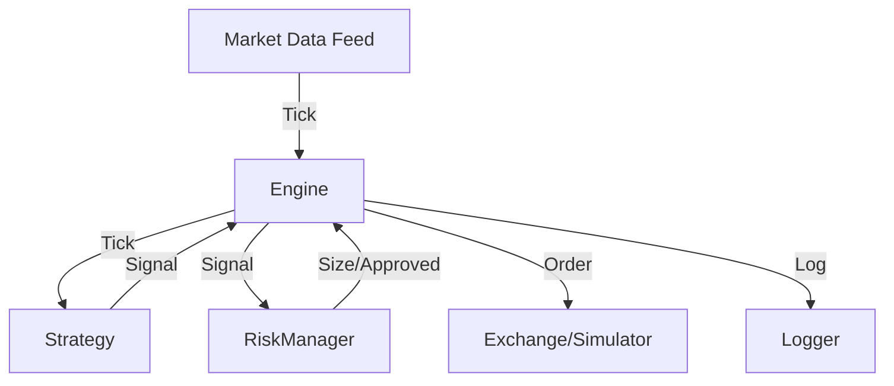

# Trading System Architecture (v4.0)

## Overview
The v4.0 Trading Engine is a modular, event-driven system designed for crypto trading. It separates strategy logic from execution, allowing for pluggable strategies and robust risk management.

## Core Components

### 1. Trading Engine (`engine.py`)
The central orchestrator. It:
- Receives Ticks from external feeds (Live or Historical).
- Updates Indicators.
- Delegates decision making to the Active Strategy.
- Consults Risk Manager for entry validation and sizing.
- Manages Position lifecycle (Entry -> Hold -> Exit).
- Logs all events via `EngineLogger`.

### 2. Strategy Interface (`strategy.py`)
Abstract Base Class for all strategies.
- **Input**: `Tick` (price, time).
- **Output**: `Signal` (Long/Short, Stop Loss, Reason).
- **Implementations**:
  - `MomentumStrategy`: Velocity-based breakout/reversal.
  - `MeanReversionStrategy`: Bollinger Bands + RSI.
  - `TrendFollowingStrategy`: EMA Crossover.
  - `BreakoutStrategy`: Range breakout.
  - `ScalpingStrategy`: High-frequency velocity bursts.

### 3. Risk Manager (`risk.py`)
Centralized risk control.
- **Position Sizing**: Calculates size based on Equity, Risk %, and Stop Distance (Kelly or Fixed).
- **Validation**: Checks Max Drawdown, Max Positions, Leverage Limits.
- **Loser Suppression**: Increases cooldown after consecutive losses.

### 4. State Machine (`state.py`)
Manages the trading lifecycle states:
- `WAIT`: Idle, looking for signals.
- `ENTRY`: Signal received, executing order.
- `HOLD`: Position open, managing stops/targets.
- `EXIT`: Position closing.
- `COOLDOWN`: Post-trade pause.

## Data Flow

## Configuration
Configuration is managed via `EngineConfig` in `engine/config.py`. It is a frozen dataclass ensuring parameters are constant during a run.
- **Strategy Selection**: `active_strategy` parameter.
- **Risk Params**: `risk` subsection (via `RiskConfig`).
- **Cost Simulation**: `trading_fee_pct`, `slippage_pct`.

## Testing & Verification
- **Unit Tests**: `test_strategies.py` verifies logic.
- **Smoke Tests**: `test_v3_2_smoke.py` verifies integration.
- **Backtesting**: `historical_runner.py` runs simulation with fees/slippage and generates reports.
